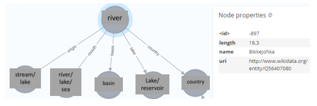

# Chatbot Knowledge Graph Neo4j

Chatbot untuk inferensi query dari knowledge graph river. Knowledge graph didapat dari wikidata ([link](https://www.wikidata.org/wiki/Q4022)) yang diolah oleh Neo4j dan chatbot berbasis Python menggunakan library Gradio sebagai User Interface (UI).

## Penjelasan Knowledge Graph
Terdapat 6 node sebagai entity dan 5 edge sebagai relation, serta terdapat 1 relation yang berisi suatu value sehingga tidak menghubungkan ke entity lain. Node river memiliki total relation sebanyak 6 relation, yaitu:
1) Origin of the watercourse (P885). Sumber utama dari river yang berupa entity
seperti stream atau lake.
2) Mouth of the watercourse (P403). Badan dari air yang mengalir keluar yang
berupa entity seperti river lain, lake, atau sea. Dapat diartikan juga tempat
keluarnya aliran air sungai.
3) Drainage basin (P4614). Area dimana presipitasi (curah hujan) terkumpul dan
dialirkan ke dalam aliran river yang berupa entity basin.
4) Lake on watercourse (P469). Lake atau reservoir yang dilewati aliran river.
5) Country (P17). Negara lokasi river berada yang berupa entity country.
6) Length (P2043). Dimensi panjang aliran sungai yang berupa value float.

<div align="center">
    <a href="./">
        
    </a>
</div>

## Import Knowledge Graph ke Neo4j
Masukkan program di bawah ke dalam Neo4j:
```
WITH 'PREFIX neo: <neo4j://voc#>
CONSTRUCT {
  ?river neo:name ?riverLabel;
    neo:origin ?origin;
    neo:mouth ?mouth;
    neo:lake ?lake;
    neo:basin ?basin;
    neo:country ?country;
    neo:length ?length.
  ?origin neo:label ?originLabel.
  ?mouth neo:label ?mouthLabel.
  ?lake neo:label ?lakeLabel.
  ?basin neo:label ?basinLabel.
  ?country neo:label ?countryLabel.
  ?length neo:label ?lengthLabel.}
WHERE {
?river wdt:P31 wd:Q4022; # Instance of river
  wdt:P885 ?origin; # Origin of the watercourse
  wdt:P403 ?mouth; # Mouth of the watercourse
  wdt:P469 ?lake; # Lake on watercourse
  wdt:P4614 ?basin; # Drainage basin
  wdt:P17 ?country; # Country of the river
  wdt:P2043 ?length; # Length of the river
SERVICE wikibase:label { # Retrieve labels for entities
bd:serviceParam wikibase:language "[AUTO_LANGUAGE],en".
}}
ORDER BY ?riverLabel
' AS sparql
CALL n10s.rdf.import.fetch(
  'https://query.wikidata.org/sparql?query='+ apoc.text.urlencode(sparql),
  'Turtle' ,
  { headerParams: { Accept: "application/x-turtle" } }
)
YIELD terminationStatus, triplesLoaded, triplesParsed, namespaces, extraInfo
RETURN terminationStatus, triplesLoaded, triplesParsed, namespaces, extraInfo
```

Sehingga didapatkan visualisasi seperti berikut:

<div align="center">
    <a href="./">
        
    </a>
</div>

## Prompting
Contoh hasil prompting dengan chatbot UI Gradio

<div align="center">
    <a href="./">
        
        
        
    </a>
</div>
